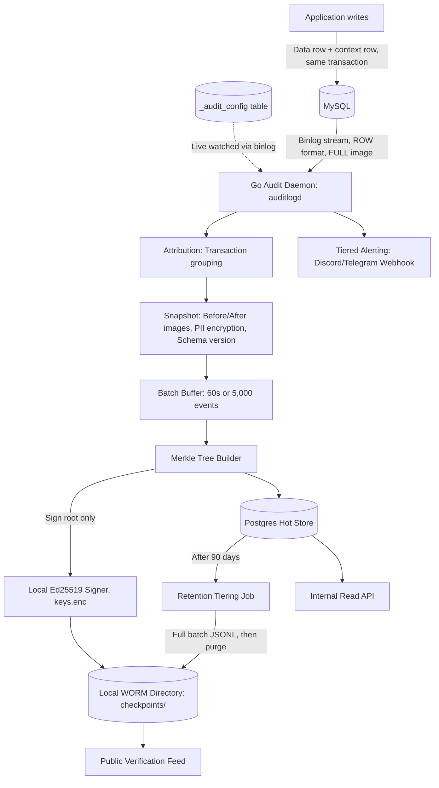

# Global Audit Logger (`auditlogd`)

[](https://golang.org)
[](https://opensource.org/licenses/MIT)
[](.github/workflows/ci.yml)
[](#tamper-evidence--dispute-verification)

A standalone, production-grade **Global Audit Logger** daemon written in Go. It taps directly into MySQL binary logs (CDC) to produce a tamper-evident, cryptographically signed, and independently verifiable audit trail of all row-level database changes.

---

## Key Features

- **CDC-Based Capture**: Connects as a MySQL replication client (`go-mysql`). Captures all row changes regardless of origin (application, migrations, direct DBA sessions) with zero modifications to application write paths.
- **Transaction-Based Attribution**: Correlates changes to acting users via a lightweight context row (`_audit_context`) committed within the same database transaction.
- **Configurable Scope & Unattributed Policy**: Table policies managed in `_audit_config` (`tolerate` vs. `alert`). Unattributed changes on critical tables trigger instant alerts with `@here` markers.
- **Dynamic Scope & Schema Hot-Reload**: Watches `_audit_config` changes live from the binlog with zero daemon downtime. Detects DDL events (`ALTER TABLE`) and version-tags subsequent records.
- **Tamper Evidence**: Changes are batched (max 60s or 5,000 events) into deterministic RFC 6962 Merkle trees. Only the Merkle root is signed with a local Ed25519 keypair.
- **Field-Level PII Encryption**: Configured sensitive columns are encrypted at rest with AES-256-GCM.
- **WORM Storage & Checkpointing**: Signed checkpoints and cold archives written to immutable storage (`0444` read-only local directory, swappable via `ArchiveStore` adapter).
- **Retention Tiering**: Automatic 90-day hot retention in PostgreSQL, with a scheduled job (`cmd/tiering`) moving full data to cold WORM archives (`.jsonl`) and purging Postgres records.
- **Zero-Trust Public Verification**: Published public keys and signed root history allow any external third party to verify proofs without accessing internal databases.
- **Internal REST API**: RBAC-guarded API (`/audit/*`) powering in-app history views and dispute resolution.

---

## Architecture



---

## Project Structure

```
.
├── cmd/
│   ├── daemon/          # Main CDC streaming, batching, signing daemon (auditlogd)
│   ├── apiserver/       # Standalone internal read API & public verification feed
│   ├── tiering/         # Standalone scheduled retention tiering job
│   ├── keygen/          # CLI tool for generating encrypted keyfile & public keys
│   └── verify/          # Standalone verification CLI tool for dispute resolution
├── internal/
│   ├── source/          # ChangeSource interface & transaction grouping definitions
│   ├── binlog/          # MySQL CDC replication client (go-mysql)
│   ├── config/          # _audit_config cache with dynamic CDC updates
│   ├── attribution/     # Transaction-boundary context-row correlation (_audit_context)
│   ├── snapshot/        # Before/after row snapshots, PII encryption, schema versioning
│   ├── batch/           # Hybrid time/count buffer, Merkle tree construction & root signing
│   ├── merkle/          # Deterministic RFC 6962 Merkle tree, proof generator & verifier
│   ├── signing/         # Signer & Encryptor interfaces with local encrypted keyfile
│   ├── archive/         # ArchiveStore interface & LocalDirArchiveStore (WORM immutability)
│   ├── store/           # PostgreSQL repositories (audit_batches, audit_records, audit_worm_index)
│   ├── alerting/        # AlertSink interface, Webhook sink & rate limiter
│   ├── api/             # HTTP router, RBAC middleware, handlers & public verification feed
│   ├── bootstrap/       # Initial consistent snapshot runner for newly registered tables
│   ├── tiering/         # Idempotent retention tiering service (90-day cold archival & purge)
│   └── pipeline/        # Ingestion pipeline orchestrating CDC -> batching -> store
├── migrations/
│   ├── postgres/        # Hot store tables (batches, records, worm_index) & role grants
│   └── mysql/           # Audited DB tables (_audit_config, _audit_context, sample table)
├── deploy/              # Multi-stage Dockerfiles for daemon, apiserver, and tiering
├── docker-compose.yml   # Full local & staging stack orchestration
├── RUNBOOK.md           # Operational runbook covering setup, alert triage & disaster recovery
└── specs/               # Complete engineering specification & architectural decision records
```

---

## Quick Start with Docker Compose

1. **Clone the repository**:
   ```bash
   git clone https://github.com/your-org/auditlogd.git
   cd auditlogd
   ```

2. **Generate initial keyfile**:
   ```bash
   go run ./cmd/keygen -action generate -keyfile ./keys/keys.enc -passphrase "dev-passphrase" -version v1
   ```

3. **Start all services**:
   ```bash
   docker compose up -d
   ```
   This provisions:
   - MySQL 8.0 with `binlog_format=ROW` and `binlog_row_image=FULL`
   - PostgreSQL 16 initialized with audit tables and roles
   - `auditlogd` CDC ingestion daemon
   - `apiserver` internal API & public verification server on `:8080`

---

## Native Build & Test

### Prerequisites
- Go 1.22+
- PostgreSQL 14+
- MySQL 8.0+

### Build All Executables
```bash
go build -o bin/auditlogd ./cmd/daemon
go build -o bin/apiserver ./cmd/apiserver
go build -o bin/tiering   ./cmd/tiering
go build -o bin/keygen    ./cmd/keygen
go build -o bin/verify    ./cmd/verify
```

### Run Test Suite
```bash
go test -v ./...
```

---

## Dispute Verification

Anyone can verify an audit record independently using the [`cmd/verify`](cmd/verify/main.go) tool:

### Verify Against Live Database:
```bash
./bin/verify -record "7f2a18c0-829d-4e92-bc10-91a82f349102" -passphrase "dev-passphrase"
```

### Verify Independent Offline Proof (Zero Internal Trust):
```bash
./bin/verify -proof-file proof.json -pubkey "<HEX_PUBLIC_KEY>"
```

Expected Output:
```text
==================================================
  RESULT: RECORD AUTHENTIC & UNTAMPERED (VALID)   
==================================================
Record ID:       7f2a18c0-829d-4e92-bc10-91a82f349102
Batch ID:        b1a89c10-5231-41fa-8a12-00129bc811a4
Merkle Root:     5e884898da28047151d0e56f8dc6292773603d0d6aabbdd62a11ef721d1542d8
Signature:       a4b9c8d7... [Ed25519 Valid]
Key Version:     v1
Verified At:     2026-09-13 20:30:00 UTC
```

---

## Operations & Runbooks

For deployment instructions, table onboarding, incident triage, disaster recovery, and retention tiering execution, consult [`RUNBOOK.md`](RUNBOOK.md).

For the complete architectural design and decision records, consult [`specs/audit-logger/`](specs/audit-logger/).

---

## License

This project is licensed under the MIT License - see the [LICENSE](LICENSE) file for details.
