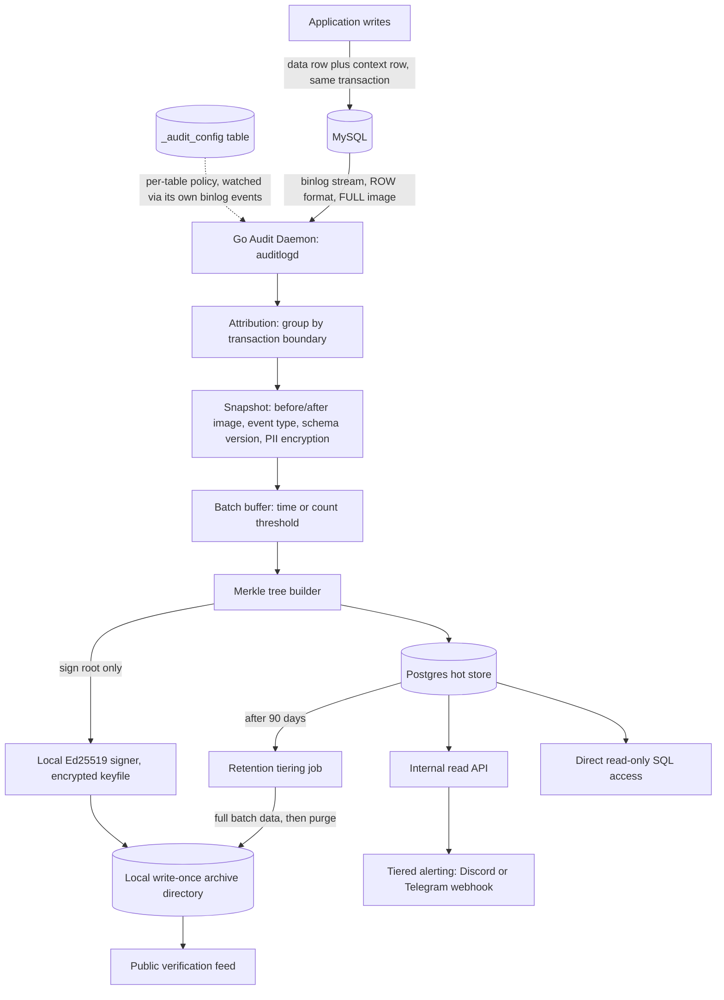
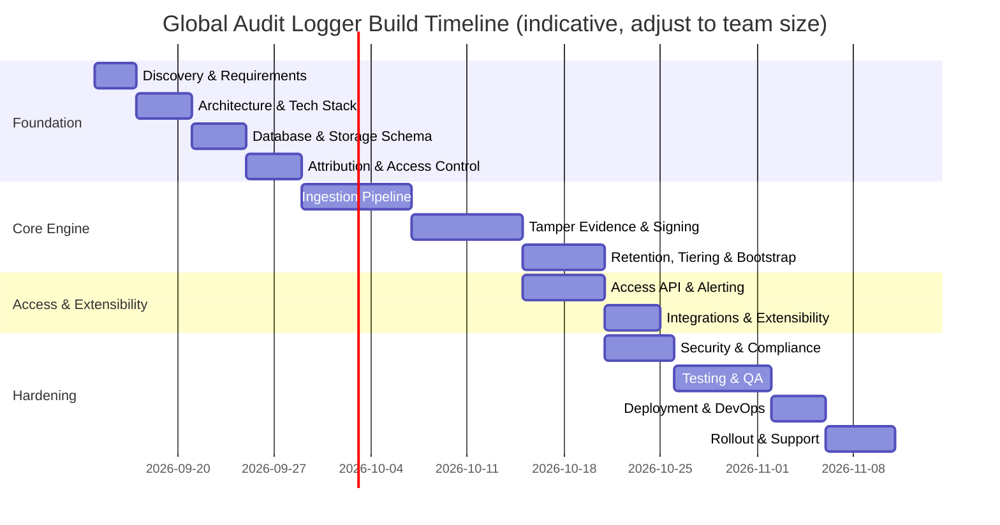

# Global Audit Logger — Full Build Plan

> Master index for building the Global Audit Logger as a standalone Go
> service that audits a MySQL-backed application.

## 0. Assumption Check (please confirm)

This plan assumes:

- This is a **new, standalone Go service** (`auditlogd`), not a module
  bolted onto an existing backend — there is no existing codebase in this
  project yet, so everything here is greenfield.
- The **audited source is a single MySQL instance** in v1 (no sharding, no
  multi-engine support — Postgres/Mongo sources are a later extension).
- **PostgreSQL** is available to provision, the WORM archive target is a
  **local write-once directory** (not a cloud provider), and signing/PII
  encryption keys live in a **local encrypted keyfile** rather than Vault
  or a cloud KMS — this is a personal project with no real large data
  volume, so the plan is deliberately right-sized rather than
  enterprise-grade.
- The people who will use the output of this system are: end
  users/customers disputing a record, compliance/security/support staff
  investigating history, backend engineers registering tables for audit,
  and potentially external auditors/regulators who need independent
  verification.

If any of these are wrong — especially the single-MySQL-source assumption,
or if this actually needs to support real production-scale data/multiple
users after all — say so and the plan/docs will be adjusted.

## 1. Vision & Goals

Build a production-grade **Global Audit Logger** that:

- Captures every row-level change to designated MySQL tables — regardless
  of whether it came from the application, a migration, or a direct SQL
  session — with zero changes to existing application write paths beyond a
  single same-transaction context-row insert.
- Attributes each change to the acting user wherever possible, and clearly
  flags changes that can't be attributed.
- Produces a tamper-evident history: changes are batched, Merkle-tree
  hashed, and the root is signed by a local Ed25519 key that's encrypted
  at rest and never stored in plaintext.
- Lets anyone — internal staff or an external, untrusting third party —
  cryptographically verify that a specific record was genuinely part of a
  specific signed snapshot.
- Keeps 90 days of full detail queryable in Postgres, then tiers full data
  (not just proofs) into cheap, immutable long-term storage.
- Alerts the right people, at the right urgency, when something suspicious
  happens (e.g., an unattributed change to a critical table).

## 2. Scope

**In scope (v1):**
CDC-based capture from the MySQL binlog, transaction-based attribution,
per-table audit configuration via `_audit_config`, full before/after
snapshots with explicit event typing, PII field encryption, batched Merkle
tree construction, local keyfile-based signing, WORM checkpoint archival,
public verifiability (published public key + roots), a Postgres hot store
with 90-day retention, tiered archival to WORM, bootstrap snapshotting for
newly-registered tables, schema hot-reload and versioning, an internal read
API, direct read-only SQL access for auditors, and tiered alerting via a
Discord/Telegram webhook.

**Out of scope (v1, candidates for later phases):**
Auditing engines other than MySQL, daemon HA/leader election,
replication-lag or daemon-health observability, sharded/multi-instance
MySQL topologies, automatic PII discovery, a citizen/customer-facing
dispute UI, regulatory retention overrides (e.g., a mandated multi-year
retention), and disaster recovery/cross-region replication of the WORM
archive.

## 3. User Roles / Personas

| Role | Key Needs |
|---|---|
| End user / customer | An independently verifiable answer when disputing a record |
| Security engineer / on-call | Attribution, tamper-evidence, tiered alerts on suspicious activity |
| Compliance officer / auditor | Direct query access, confidence the trail can't be silently edited |
| Backend engineer | Low-friction way to register a table for audit; no per-write SDK burden |
| Database administrator | Predictable retention/storage growth, schema-change safety |
| External auditor / regulator | Ability to verify integrity without trusting internal tooling |
| Data privacy officer | PII protected at rest, access to decryption gated and auditable |

## 4. Recommended Tech Stack

| Layer | Choice | Why |
|---|---|---|
| Daemon language/runtime | Go | Single static binary, low overhead, strong concurrency for a long-running stream processor |
| CDC / binlog client | `go-mysql` | Lightweight, direct binlog access — no Kafka/Debezium operational overhead |
| Hot audit store | PostgreSQL | Relational + JSONB for flexible snapshot payloads, strong tooling, easy ad hoc SQL for auditors |
| Migrations | `golang-migrate` | Versioned, reviewable schema evolution (the Go-ecosystem equivalent of Alembic) |
| Cold/tamper-evident archive | Local write-once directory, behind an internal `ArchiveStore` interface | No cloud account needed at personal-project scale; best-effort immutability (write-then-chmod-read-only) is an accepted trade-off; a cloud provider is a later swap if ever needed |
| Key management & signing | Local encrypted keyfile (Ed25519 signing + AES-256-GCM PII), OS keychain holds the unlock passphrase | No extra service to run; `Signer`/`Encryptor` interfaces keep Vault/KMS available as a later swap if ever needed |
| Internal access | Authenticated internal HTTP API + direct read-only Postgres role | Serves in-app history views and ad hoc auditor/compliance queries |
| Alerting | One Discord/Telegram webhook, with an @mention/distinct marker for critical | Matches severity-tiered alerting decision without needing an on-call paging service |
| Local/staging dependencies | Docker Compose: MySQL, Postgres | No Vault/MinIO needed — the local signer and local archive directory run identically in every environment |
| Testing | `testcontainers-go` | Real ephemeral MySQL/Postgres instead of mocking wire protocols; the local signer/archive need no container at all |

## 5. High-Level Architecture

## 6. Complete Feature Catalog (all functions & components)

1. **Binlog Capture & CDC** — direct MySQL binlog consumption, no
   intermediate broker.
2. **Transaction-Based Attribution** — context-row correlation via
   BEGIN/XID/COMMIT grouping.
3. **Audit Scope Configuration** — `_audit_config` table, migration-managed,
   live-watched by the daemon itself.
4. **Full Snapshot Capture & Event Tagging** — before/after images,
   INSERT/UPDATE/DELETE tagging.
5. **PII Field Encryption** — local AES-256-GCM encryption (via the
   `Encryptor` interface) for configured sensitive columns.
6. **Batching & Merkle Tree Construction** — hybrid time/count batch
   closing.
7. **Local Keyfile-Backed Signing** — only the Merkle root is signed, by a
   local Ed25519 key encrypted at rest (via the `Signer` interface).
8. **WORM Checkpoint Archival** — signed roots and batch metadata pushed to
   immutable storage.
9. **Public Verifiability** — published public key + historical signed
   roots, independent of internal trust.
10. **Hot Store & Retention Tiering** — 90-day Postgres retention, then
    full-data tiering to WORM.
11. **Bootstrap Snapshotting** — Merkle-anchored initial snapshot for
    newly-registered tables.
12. **Schema Hot-Reload & Versioning** — zero-downtime DDL handling with
    per-record schema version tags.
13. **Binlog Position Checkpointing & Crash Recovery** — transactional,
    consistent resumption after restart.
14. **Internal Read API** — authenticated, RBAC-scoped history queries.
15. **Direct SQL Access** — read-only role for compliance/security/auditors.
16. **Tiered Alerting** — one Discord/Telegram webhook, with an
    @mention/distinct marker for critical tables, on unattributed changes.
17. **Verification Tooling** — Merkle path + signature verification given a
    record ID.
18. **Security & Compliance Hardening** — secrets management, encryption in
    transit/at rest, dependency scanning.
19. **Deployment & Observability** — containerized environments, CI/CD,
    structured logging, health checks.

## 7. Phase Roadmap

| Phase | File | Focus |
|---|---|---|
| 0 | [`01-discovery-requirements.md`](01-discovery-requirements.md) | Requirements, decisions log, open questions |
| 1 | [`02-architecture-design.md`](02-architecture-design.md) | System design, module boundaries, conventions |
| 2 | [`03-database-storage-schema.md`](03-database-storage-schema.md) | Postgres schema, WORM archive layout |
| 3 | [`04-attribution-access-control.md`](04-attribution-access-control.md) | Attribution mechanics, local key setup, RBAC |
| 4 | [`05-ingestion-pipeline.md`](05-ingestion-pipeline.md) | Binlog capture, correlation, snapshotting |
| 5 | [`06-tamper-evidence-signing.md`](06-tamper-evidence-signing.md) | Batching, Merkle trees, signing, verification |
| 6 | [`07-retention-tiering-bootstrap.md`](07-retention-tiering-bootstrap.md) | Retention job, WORM tiering, bootstrap snapshots |
| 7 | [`08-access-api-alerting.md`](08-access-api-alerting.md) | Internal API, direct SQL, public verification, alerting |
| 8 | [`09-integrations-extensibility.md`](09-integrations-extensibility.md) | Adapter seams for future engines/providers |
| 9 | [`10-security-compliance.md`](10-security-compliance.md) | Hardening, secrets, PII, dependency audits |
| 10 | [`11-testing-qa.md`](11-testing-qa.md) | Unit/integration/E2E-style tests, load & chaos tests |
| 11 | [`12-deployment-devops.md`](12-deployment-devops.md) | Docker, CI/CD, environments, observability |
| 12 | [`13-rollout-runbook-support.md`](13-rollout-runbook-support.md) | Table-by-table rollout, runbook, ongoing support |

## 8. Timeline Overview (indicative)

Total: roughly **9–11 weeks** for a small team (1–2 backend/infra
engineers, part-time security/compliance review), sequential where
dependencies require it, parallel where noted (access API work can start
once the ingestion pipeline's data shape is settled, without waiting for
tiering/bootstrap to be finished).

## 9. How To Use These Docs

- Work phase by phase; each phase file is self-contained with objectives,
  functional requirements, components, tasks, deliverables, and a
  Definition of Done.
- Check off tasks as you go — these are meant to be living documents.
- Phase 2 (storage schema) and Phase 3 (attribution/access control) should
  be locked before Phase 4 starts in earnest, since the pipeline depends on
  both.
- Phase 7 (access API) can start scaffolding once Phase 4's data shape is
  settled, in parallel with Phase 5/6, using fixture data until real
  batches exist.
- This plan supersedes nothing in
  [`../global-audit-logger.md`](../global-audit-logger.md) — that file is
  the decisions-and-rationale spec; these phase docs are the execution plan
  built from it.
