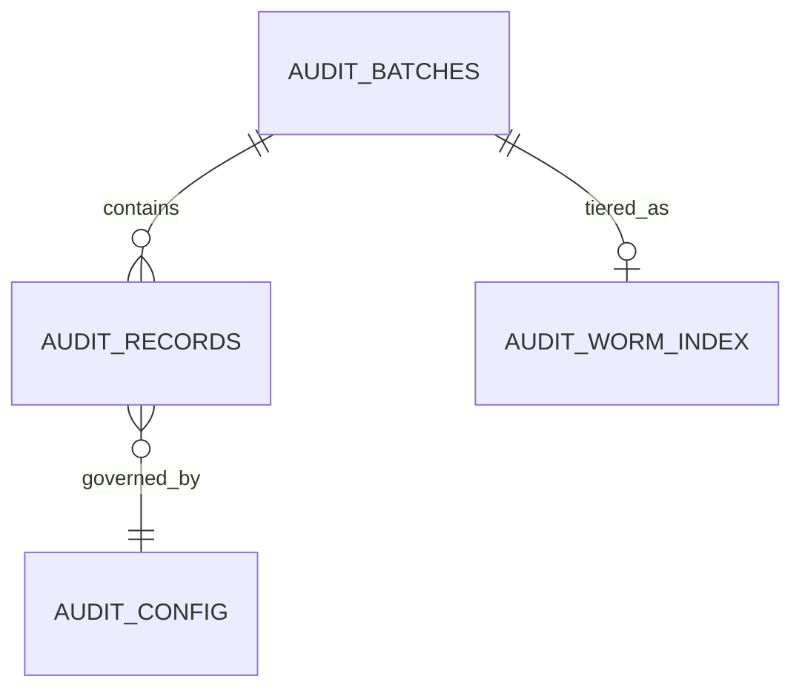

# Phase 2 — Database & Storage Schema

**Goal:** Design the full audit data model: the Postgres hot store, the
`_audit_config` table, and the WORM archive layout.
**Estimated Duration:** 4–5 days
**Depends On:** Phase 0, Phase 1
**Primary Owner:** You (solo project)

## Design Principle

The daemon does **not** own or modify the audited application's MySQL
schema — it only reads its binlog. Everything in this phase is the audit
logger's **own** storage: the Postgres hot store it writes to, and the WORM
archive it tiers into. `_audit_config` is the one table that lives inside
the **audited application's** MySQL database (so the daemon can watch it
via the same binlog mechanism as everything else) — see note below.

## `_audit_config` (lives in the audited MySQL database)

```
_audit_config
  table_name (primary key)
  enabled (bool)
  unattributed_policy (tolerate | alert)
  severity_tier (normal | critical)         -- only meaningful when policy = alert
  encrypted_columns (json array of column names)
  bootstrap_required (bool)
  bootstrap_status (not_started | in_progress | complete)
  created_at, updated_at
```

- Rows are inserted/updated via the application's normal migration tooling,
  alongside the migration that creates/alters the table being registered.
- The daemon watches this table's own binlog events (INSERT/UPDATE/DELETE)
  to pick up scope changes live — see Phase 4.

## Postgres Hot Store

### `audit_batches`

```
audit_batches
  id (uuid, primary key)
  started_at, closed_at
  event_count
  merkle_root (bytea)
  signature (bytea)
  key_version                        -- local signing key version, for future rotation
  binlog_file, binlog_position       -- checkpoint: position at closed_at
  status (open | closed | signed | archived | purged)
  worm_object_key (nullable until archived)
  is_bootstrap (bool)
  bootstrap_table_name (nullable, set when is_bootstrap = true)
```

### `audit_records`

```
audit_records
  id (uuid, primary key)
  batch_id -> audit_batches
  table_name
  primary_key (jsonb, supports composite keys)
  event_type (INSERT | UPDATE | DELETE)
  before_image (jsonb, nullable for INSERT)
  after_image (jsonb, nullable for DELETE)
  actor_user_id (nullable)
  actor_type (USER | SYSTEM | UNATTRIBUTED)
  transaction_id                      -- MySQL GTID or binlog Xid
  schema_version                       -- hash/id of table's column set at capture time
  committed_at                          -- MySQL commit time
  merkle_leaf_index                      -- position within the batch's Merkle tree
```

### `audit_worm_index`

```
audit_worm_index
  batch_id -> audit_batches
  worm_object_key
  tiered_at
  purged_from_postgres_at (nullable)
```

Tracks which batches' full record data has been moved to WORM storage and
purged from `audit_records`, independent of the `audit_batches.status`
field, so the tiering job's own history is itself auditable.

## WORM Archive Layout

- One object per **signed batch checkpoint**: contains the Merkle root,
  signature, local key version, batch time range, and binlog position —
  written at signing time (Phase 5), independent of retention tiering.
- One object per **tiered batch archive**: contains the full
  `audit_records` rows for that batch — written by the retention tiering
  job (Phase 6), only after the 90-day window closes.
- Object keys are content-addressed or batch-id-addressed (e.g.
  `checkpoints/{batch_id}.json`, `archives/{batch_id}.jsonl`) so lookups by
  batch id don't require a separate index for the checkpoint objects
  themselves (only the tiered-archive objects need the `audit_worm_index`
  lookup table, since checkpoints are written for every batch regardless of
  tiering).
- Concrete implementation: a **local write-once directory**, with
  `checkpoints/` and `archives/` subpaths. Each object is written once and
  then `chmod`'d to read-only (0444) immediately after the write completes.
  This is intentionally **best-effort** immutability, not cloud-grade
  Object Lock — it protects against accidental overwrite, application
  bugs, and casual tampering, but not against a determined local user with
  root/administrator access to the machine. That trade-off is accepted for
  a personal project (Phase 9 documents it explicitly); moving to S3 Object
  Lock later, if this ever needs a stronger guarantee, is a new
  `ArchiveStore` implementation, not a redesign.

## Entity-Relationship Diagram



(`AUDIT_CONFIG` here represents `_audit_config`, which lives in the audited
MySQL database, not Postgres — shown for relationship clarity only.)

## Indexing & Constraints

- Unique: none needed beyond primary keys; `audit_records.id` is a UUID
  generated at capture time, not derived from the source row's primary key
  (multiple audit records exist per source row over its lifetime).
- Index: `audit_records(table_name, primary_key)` — the main "history for
  this record" lookup.
- Index: `audit_records(batch_id)` — Merkle proof reconstruction.
- Index: `audit_batches(closed_at, status)` — retention tiering job's
  candidate-selection query.
- `audit_records` and `audit_batches` are **append-only**: no update/delete
  endpoint or code path exists for them outside the retention tiering job's
  documented purge step.

## Migration Plan

1. Initialize `golang-migrate` against a fresh Postgres instance.
2. Migration 1: `audit_batches`.
3. Migration 2: `audit_records` (depends on `audit_batches`).
4. Migration 3: `audit_worm_index`.
5. Separate migration (in the **audited application's** migration tool, not
   `golang-migrate`): `_audit_config`, plus one row per table being
   registered for audit, added in the same migration that creates/alters
   that table going forward.

## Deliverables

- `golang-migrate` migrations for all Postgres tables above.
- `_audit_config` migration template/example for the audited application's
  own migration tool.
- ER diagram (above), kept up to date as schema evolves.

## Acceptance Criteria / Definition of Done

- [ ] All Postgres tables created via `golang-migrate` migrations, not ad
      hoc DDL.
- [ ] `_audit_config` exists in the audited MySQL database with at least
      one real registered table for local dev/testing.
- [ ] Every `audit_records` row can be traced back to its `audit_batches`
      row and from there to a WORM checkpoint object.
- [ ] Diagram matches the actual migrated schema.
