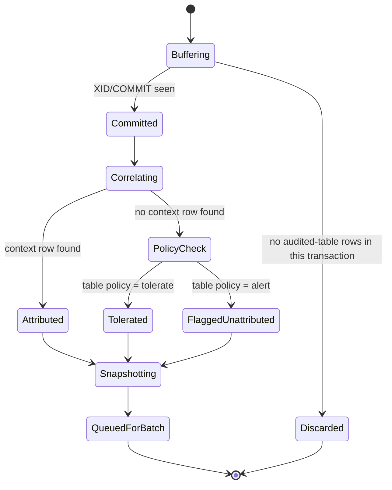

# Phase 4 — Ingestion Pipeline: Binlog Capture, Correlation & Snapshotting

**Goal:** Build the core daemon loop that turns raw binlog events into
attributed, snapshotted, event-tagged audit records ready for batching.
**Estimated Duration:** 8 days
**Depends On:** Phase 2, Phase 3
**Primary Owner:** You (solo project)

## Functional Requirements

- Connect to MySQL as a replication client and stream the binlog
  (`go-mysql`), using `ROW` format with `FULL` row images.
- Group row events by transaction boundary (`BEGIN` → rows → `XID`/`COMMIT`).
- Correlate each transaction's data-row changes with its context-row insert
  (Phase 3) for attribution.
- Capture full before/after snapshots for every changed row on an audited
  table, tagging the event type (`INSERT`/`UPDATE`/`DELETE`).
- Encrypt configured sensitive columns (per
  `_audit_config.encrypted_columns`) via the local `Encryptor`
  (AES-256-GCM) before the snapshot is handed off for persistence.
- Detect DDL events on audited tables and hot-reload the cached schema,
  tagging subsequent records with the new schema version.
- Watch `_audit_config`'s own binlog events to add/remove/update audited
  tables live, with no daemon restart.
- Commit the current binlog position transactionally as part of each closed
  batch (ties into Phase 5's batch-close step).

## Components

- **Binlog Client** — wraps `go-mysql`, exposes a stream of parsed events
  (row events, XID, DDL/query events) with transaction grouping already
  applied.
- **Config Watcher** — maintains an in-memory view of `_audit_config`,
  updated live from its own binlog stream; the single source of truth the
  rest of the pipeline consults for "is this table audited, and how."
- **Attribution Correlator** — given a grouped transaction, finds the
  context-row insert (if any) and resolves `actor_user_id`/`actor_type` for
  every data-row change in that transaction.
- **Snapshot Builder** — constructs the before/after JSON image for a row
  event, applies column encryption, and tags the event type.
- **Schema Cache** — per-table column metadata, refreshed on DDL detection,
  used both to decode row events correctly and to compute
  `schema_version`.

## Per-Transaction Processing Flow

## Business Rules

- A transaction touching multiple audited tables produces one audit record
  per changed row, all sharing the same `transaction_id` and resolved
  actor.
- A transaction touching both audited and non-audited tables only produces
  records for the audited tables' rows.
- DDL on an audited table triggers an immediate schema-cache refresh before
  any further row events for that table are decoded — never decode with a
  stale schema.
- A `DELETE` produces a record with a full `before_image` and a null
  `after_image` (tombstone). A soft-delete (an `UPDATE` that happens to set
  a `deleted_at`-style column) is captured as a normal `UPDATE` — the
  daemon does not special-case it (Phase 0, decision 28).
- If `_audit_config` marks a table `enabled = false` mid-stream, in-flight
  transactions already buffered for that table still complete and are
  recorded (no partial/torn records); only transactions starting after the
  change are skipped.

## Tasks

- [ ] Implement the binlog client wrapper with transaction-boundary
      grouping.
- [ ] Implement the config watcher consuming `_audit_config`'s binlog
      stream.
- [ ] Implement the attribution correlator.
- [ ] Implement the snapshot builder, including the PII encryption hook.
- [ ] Implement the schema cache with DDL-triggered hot-reload and version
      tagging.
- [ ] Implement per-table unattributed-change policy evaluation.
- [ ] Wire a (stubbed, until Phase 7) alert call for `UNATTRIBUTED` records
      on `alert`-policy tables.
- [ ] Validate against the primary testing seam (Phase 10) end-to-end on
      one real audited table.

## Deliverables

- Working ingestion pipeline that, given a live MySQL binlog stream,
  produces correctly attributed, snapshotted, event-tagged audit records in
  memory (persistence lands with Phase 5's batch/store integration).
- Demonstrated DDL hot-reload with zero misdecoded events across a live
  `ALTER TABLE`.
- Demonstrated live pickup of a new `_audit_config` row without a restart.

## Acceptance Criteria / Definition of Done

- [ ] A real transaction (context row + data change, same transaction)
      produces one correctly attributed record.
- [ ] A transaction with no context row is tagged per the table's
      configured policy.
- [ ] An `ALTER TABLE` on an audited table does not corrupt or drop
      subsequent events, and new records carry the updated schema version.
- [ ] Adding a row to `_audit_config` for a previously-unaudited table
      results in that table's changes being captured within one binlog
      poll cycle, no restart required.
