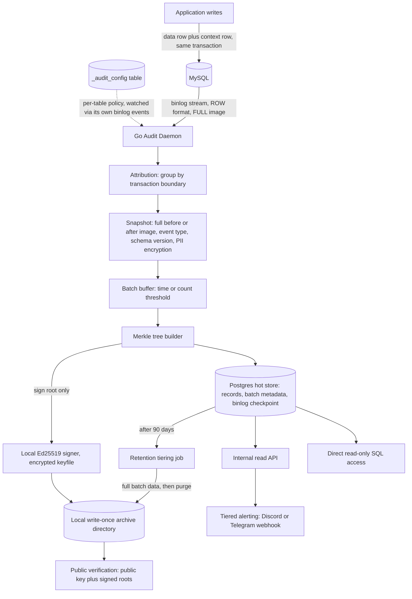

# Global Audit Logger — Specification

## Problem Statement

Organizations running a production MySQL database have no trustworthy, tamper-evident record of **who** changed a given piece of data, **what** exactly changed, and **when** it happened. Today, if a record is disputed — a customer questions a transaction, a regulator asks for proof, or a security team suspects insider tampering — there is no reliable way to answer with certainty. Application logs are incomplete (they miss anything that didn't go through the app, like direct DB access, migrations, or admin scripts), can be edited after the fact, and carry no cryptographic proof that they weren't altered.

Three distinct groups feel this pain:

- **End users / customers** who dispute a transaction or record and need a definitive, independently verifiable answer about what happened to their data.
- **Compliance, security, and support teams** who need to reconstruct history quickly and trust that the trail itself hasn't been altered — including by someone with database access.
- **Engineering teams** who need this assurance without rewriting application code, coupling audit logic to every write path, or accepting a performance hit on the primary database.

## Solution

A **Global Audit Logger**: a standalone Go daemon that taps directly into the MySQL binary log (binlog) via Change Data Capture (CDC), so every row-level change is captured regardless of what wrote it — application code, a migration, or a direct SQL session. The daemon:

- Correlates each data change back to the application user who caused it, using a lightweight per-transaction context row rather than modifying application write paths.
- Captures full before/after snapshots of every changed row, tagged with an explicit event type (INSERT/UPDATE/DELETE).
- Batches changes, builds a Merkle tree over each batch, and signs only the Merkle root with a local Ed25519 private key, encrypted at rest and unlocked via the OS keychain — producing a small, cheap-to-verify, tamper-evident checkpoint per batch with no extra key-management service to run.
- Pushes signed checkpoints to a local write-once archive directory, and publishes the public key and signed roots externally, so integrity can be verified by anyone — not just by trusting internal systems.
- Stores queryable full detail in PostgreSQL for 90 days, then tiers full batch data into WORM storage, keeping the audit trail cheap to operate long-term while remaining fully retrievable.
- Exposes the trail through an internal API (for in-app "history" views) and direct read-only SQL access (for auditors/compliance), plus a public verification path for independently proving any single record was part of a specific signed snapshot.

## Architecture Overview

## User Stories

1. As a support agent, I want to see the full history of a disputed record, so that I can resolve customer disputes quickly and accurately.
2. As a customer/citizen disputing a transaction, I want an independently verifiable proof that a specific record existed in a specific state at a specific time, so that I don't have to just trust the company's word for it.
3. As a security engineer, I want every row-level change to a sensitive table captured — even ones made outside the application — so that insider threats and unauthorized direct DB access don't go unnoticed.
4. As a security engineer, I want to know exactly which user or system action caused a specific data change, so that I can attribute suspicious activity to a specific actor.
5. As a security engineer, I want changes with no identifiable actor on a critical table to page on-call immediately, so that potential security incidents get an immediate human response.
6. As a security engineer, I want changes with no identifiable actor on a non-critical table to just be visible in my Discord/Telegram channel, so that expected system/batch activity doesn't trigger alert fatigue.
7. As a compliance officer, I want to query the audit trail directly via SQL, so that I can run ad hoc investigations without waiting on engineering to build a report.
8. As a compliance officer, I want confidence that no one — including a database administrator — could quietly edit or delete audit history, so that the trail is trustworthy even against insider tampering.
9. As an external auditor/regulator, I want to verify the integrity of the audit trail without relying on the company's internal tooling or word, so that I can independently confirm the trail hasn't been tampered with.
10. As a backend engineer, I want to register a new table for auditing by adding it to a configuration table via a normal migration, so that audit scope is versioned and reviewed alongside schema changes rather than living in a separate untracked config file.
11. As a backend engineer, I want auditing of a newly registered table to start working immediately without restarting the audit daemon, so that enabling auditing is a low-friction, zero-downtime operation.
12. As a backend engineer, I want to write application code without needing to set special session variables or call an audit SDK on every write, so that adding auditing doesn't require touching every existing write path.
13. As a backend engineer, I want the daemon to keep working correctly across schema migrations (columns added/removed/renamed) without downtime or misdecoded events, so that routine schema evolution never breaks the audit trail.
14. As a backend engineer, I want every historical audit record to remain interpretable even after the underlying table's schema has changed, so that old records aren't corrupted or ambiguous when read back later.
15. As a data privacy officer, I want sensitive/PII fields encrypted at rest within the audit trail, so that the audit system itself doesn't become a new source of data exposure.
16. As a data privacy officer, I want encryption/decryption of sensitive audit fields governed by the same access policies as our other sensitive systems, so that access control stays centralized and auditable.
17. As an operations engineer, I want the audit daemon to resume exactly where it left off after a crash or restart, so that no changes are silently missed or double-recorded.
18. As an operations engineer, I want the daemon's binlog position and its audit records committed together, so that there's never an inconsistency between "what we recorded" and "where we resumed reading."
19. As an operations engineer, I want the daemon to run as a simple single-instance process managed by a supervisor, so that I don't need to operate a complex HA/leader-election setup for the initial version.
20. As a product engineer, I want an internal API to fetch a record's change history, so that I can build an in-app "history" view on a record's detail page.
21. As a database administrator, I want the hot audit store to automatically shed data older than 90 days into cheaper long-term storage, so that the operational Postgres database doesn't grow unbounded.
22. As a database administrator, I want tiered-out audit data to remain fully retrievable (not just a hash/proof of it), so that "moved to cold storage" never means "lost."
23. As an engineer investigating a dispute, I want to pull the signed Merkle root and Merkle path for a specific record and verify it against the daemon's public signature, so that I can prove — not just claim — that record was part of an authentic, untampered snapshot.
24. As a backend engineer, I want a table that previously had no auditing enabled to get a one-time snapshot of its existing rows when auditing is turned on, so that "day one" history isn't a blank slate with no prior context.
25. As a security engineer, I want that initial bootstrap snapshot to be cryptographically anchored (Merkle + signed) just like ongoing changes, so that there's no unsigned, unverifiable gap at the very start of a table's audit history.
26. As a backend engineer, I want DELETE operations to be recorded as clear tombstones with the full last-known row state, so that I can see exactly what existed right before it was removed.
27. As a backend engineer, I want to distinguish a soft-delete (e.g., `UPDATE ... SET deleted_at = NOW()`) from a genuine hard DELETE by looking at the event type and which columns changed, so that I don't need special-cased logic to understand row lifecycle.
28. As an engineering manager, I want the choice of audited database, CDC mechanism, and storage tiers to not require rewriting application code, so that adopting this system is a backend/infra-only rollout.
29. As a compliance officer, I want a documented retention policy (90 days hot, tiered to WORM after), so that I can explain our audit data lifecycle to auditors and regulators.
30. As a security engineer, I want the daemon's signing key encrypted at rest and never stored in plaintext, so that casually finding the keyfile on disk doesn't hand someone the key needed to forge or repudiate signed checkpoints.
31. As a backend engineer, I want the `_audit_config` table itself to be watched for changes the same way any other audited table would be, so that enabling/disabling audit tracking is dynamic and consistent with the rest of the system's design.
32. As a support engineer, I want to see whether a given row's history includes any unattributed/system changes, so that I can flag potential explanations for unexpected data states to the customer.

## Implementation Decisions

### Capture & Interception
- Auditing is implemented via **Change Data Capture (CDC)** against the MySQL binary log — not via ORM/application hooks, database triggers, or API-layer middleware. This ensures every row-level change is captured regardless of what wrote it (application, migration, or direct SQL session).
- The audited database engine is **MySQL**. CDC is implemented with a **lightweight Go binlog-reader library (`go-mysql`)** rather than a full CDC platform (Debezium/Kafka) or a managed CDC service — the daemon owns binlog parsing and delivery directly, with no intermediate broker.
- MySQL is configured with **`binlog_row_image=FULL`**, so every UPDATE/DELETE row event in the binlog carries the complete before-image and after-image, not just changed columns. This is a required server-side configuration, accepted alongside its binlog volume/disk I/O cost.
- The daemon is a **single Go process** responsible for: reading the binlog stream, grouping events into transactions, correlating attribution, building snapshots, batching, Merkle-tree construction, signing, and writing to both the hot store and WORM archive.

### Attribution ("Who")
- Application code writes a lightweight **context row** (containing the acting user/request identity) in the **same database transaction** as the actual data change. No session variables, no per-write SDK calls, and no extra columns on audited tables are required.
- The daemon correlates a data change to its actor by **grouping binlog row events by transaction boundary** (BEGIN → row events → XID/COMMIT), matching the context-row insert against the data-row change(s) committed in that same transaction.
- When no context row exists for a given change (e.g., a migration, a manual admin query, or a bulk import), the daemon's behavior is **configurable per table** via `_audit_config`:
  - Some tables tolerate unattributed changes and simply tag the actor as `SYSTEM`/`UNATTRIBUTED` (e.g., tables touched by trusted batch jobs or migrations).
  - Other tables are marked **strict**, where an unattributed change is treated as a potential security event and raises an alert (see Access & Alerting below) in addition to being recorded.

### Audit Scope & Configuration
- Audit scope is **annotation-driven**: a table is audited only if it has a corresponding entry in a dedicated **`_audit_config` metadata table**, rather than a naming convention, table comments, or a standalone config file.
- `_audit_config` entries (and changes to them) are introduced via the same **schema migration tooling** used for the rest of the schema, so audit scope changes are versioned and reviewed alongside the schema changes that motivate them (e.g., a migration that creates a new `payments` table also adds its `_audit_config` row in the same migration).
- Per-table configuration in `_audit_config` covers at least: whether the table is audited at all, the unattributed-change policy (tolerate vs. alert), the alert severity tier (normal vs. critical/paging), which columns (if any) require encryption-at-rest, and whether a bootstrap snapshot is required when auditing is first enabled.
- The daemon treats `_audit_config` as **just another audited-for-behavior table**: it watches `_audit_config`'s own binlog events (INSERT/UPDATE/DELETE) to detect newly registered, modified, or removed audit configurations, and dynamically starts/stops tracking the affected tables **without requiring a daemon restart**.

### Data Model & Change Representation
- Every captured change is stored as a **full before/after row snapshot** (not a field-level diff only) — self-contained and reconstructable without replaying prior history.
- Every audit record is tagged with an **explicit event type**: `INSERT`, `UPDATE`, or `DELETE`.
  - A `DELETE` produces a clear **tombstone**: full last-known row as the before-image, with no after-image.
  - A soft-delete (e.g., an application-level `UPDATE` setting a `deleted_at` column) is captured as a normal `UPDATE` event; consumers distinguish it from other updates at query time by inspecting which columns changed, rather than the daemon inferring a synthetic delete-like event type.
- Each audit record is tagged with the **schema version** (e.g., a hash or version identifier of the table's column set) in effect at the moment of capture, so historical records remain correctly interpretable even as the table's schema evolves later.
- Configured sensitive/PII columns (per `_audit_config`) are **encrypted at rest** using a local AES-256-GCM key before being persisted — not redacted/masked and not merely access-controlled at the table level. The key lives in the same encrypted local keyfile as the signing key (see Tamper Evidence below), and decryption is restricted to the internal API's authorized read paths.

### Tamper Evidence & Signing
- Captured events are grouped into **batches** using a **hybrid cadence**: a batch closes when either a time threshold or an event-count threshold is reached, whichever comes first (exact thresholds are a tunable configuration value, to be set based on observed production write volume rather than fixed in this spec).
- For each batch, the daemon builds a **Merkle tree** over the batch's audit records and computes the **Merkle root**.
- Only the **Merkle root is signed** — using a **local Ed25519 keypair**, with the private key encrypted at rest on disk and unlocked at daemon startup via a passphrase held in the OS keychain, so the key material is never stored in plaintext or committed to source.
- The signed root (plus batch metadata, such as batch id/time range and the binlog position it corresponds to) is pushed to the **local write-once archive directory**.
- **Dispute/verification flow**: given a specific record, retrieve the signed root and Merkle path for the batch it belongs to, verify the signature against the daemon's public key, and use the Merkle path to prove that specific record was mathematically included in that exact signed snapshot.
- The daemon's signing key is managed through a **local encrypted keyfile** (no cloud KMS, no HSM, no Vault) — chosen to avoid running or paying for an extra key-management service at personal-project scale, while still keeping the key encrypted rather than stored in plaintext. A `Signer` interface abstracts this choice, so a future move to Vault/KMS (if this ever needs multi-user or higher-assurance key custody) is a new implementation of that interface, not a redesign.
- **Verification is publicly exposed**: the signing public key and the full history of signed Merkle roots are published externally (e.g., a publicly accessible endpoint or feed), so that integrity can be independently verified by a third party without needing to trust your internal tooling.

### Storage, Retention & Archival
- Storage is **hybrid**: **PostgreSQL** serves as the hot, queryable store; a **local write-once archive directory** serves as the durable, tamper-evident long-term archive, sitting behind an internal `ArchiveStore` abstraction so a cloud provider (e.g., S3 Object Lock) can be swapped in later if this ever needs to scale beyond a personal project.
- PostgreSQL holds: individual audit records (full snapshots, event type, actor/context reference, schema version tag), batch/checkpoint metadata (Merkle root, signature, time range), and the daemon's current binlog position/checkpoint.
- **Retention**: audit records are retained in PostgreSQL for **90 days**. After that window, a scheduled tiering job moves the **full batch data** (not just the signed root) into WORM storage as archival files, and purges the corresponding rows from PostgreSQL. Signed roots and signatures remain permanently referenced and retrievable regardless of tiering state — "moved to cold storage" never means data is lost, only that access is slower.
- The daemon's **binlog read position** (file + offset, or GTID) is committed to PostgreSQL **in the same transaction** as the audit records and batch metadata it corresponds to, guaranteeing strict consistency between "what's recorded" and "where processing will resume" after a restart.

### Resilience, Schema Evolution & Bootstrapping
- The daemon runs as a **single instance**, managed by a process supervisor (systemd/Docker/Kubernetes) that restarts it on failure. There is no leader election, active-passive failover, or multi-instance HA in this version; a brief gap in live processing during restart is acceptable, since unread binlog events remain available (given adequate binlog retention on the MySQL side) until the daemon catches up.
- On detecting a **DDL event** (e.g., `ALTER TABLE`) for an audited table, the daemon **hot-reloads its cached schema** for that table immediately — no restart, no processing gap — and begins tagging subsequent records with the new schema version.
- When a table is **newly registered** for auditing (at initial rollout or later via `_audit_config`), the daemon performs a **one-time bootstrap snapshot** of the table's existing rows (actor tagged as `SYSTEM`/`BACKFILL`), and this bootstrap batch is run through the **same Merkle-tree-and-signing pipeline** as ongoing changes before live binlog capture takes over for that table — ensuring there is no unsigned/unverifiable starting point in any table's history.
- Replication-lag monitoring and daemon health observability (e.g., a lag metric or heartbeat mechanism) are **explicitly deferred** — not built in this version. This is a known, accepted gap for v1.

### Access, Verification & Alerting
- Two access paths are supported: an **internal read API** (authenticated, RBAC-scoped) that powers in-app "history" views for end users/support staff, and **direct read-only SQL access** to the Postgres audit store for auditors, compliance, and security teams doing ad hoc investigation.
- **Alerting is tiered by severity**, configured per table in `_audit_config`, delivered through a single **Discord/Telegram webhook**:
  - Unattributed changes on a normal "strict" table post a plain notification to the channel.
  - Unattributed changes on a table flagged **critical** (e.g., payments, permissions) post to the same channel with an **@mention and a distinct marker**, in place of formal on-call paging.

## Implementation Roadmap

Phases are ordered by dependency: each phase relies on the infrastructure or capability established in the one before it.

1. **Phase 0 — Prerequisites & Infrastructure**
   - Generate a local Ed25519 signing keypair and an AES-256-GCM PII encryption key; encrypt both at rest in a local keyfile and store the unlock passphrase in the OS keychain.
   - Provision the PostgreSQL instance/schema for the hot audit store.
   - Create a local write-once archive directory (`checkpoints/` and `archives/` subpaths) behind the `ArchiveStore` abstraction.
   - Configure MySQL: `binlog_format=ROW`, `binlog_row_image=FULL`, and a binlog retention window generous enough to cover expected daemon downtime.

2. **Phase 1 — Core Ingestion Pipeline (MVP, one table, no tamper evidence yet)**
   - Build the Go daemon skeleton with a `go-mysql` binlog client.
   - Create the `_audit_config` table and make the daemon watch its own binlog events first, since every later phase depends on dynamic config being live.
   - Implement transaction-boundary grouping (BEGIN → rows → XID/COMMIT) and context-row correlation for attribution.
   - Implement full before/after snapshot capture with explicit event-type tagging (INSERT/UPDATE/DELETE).
   - Persist raw audit records straight to Postgres (no batching/signing yet), committing the binlog checkpoint transactionally alongside them.
   - Validate end-to-end against the primary testing seam (below) on one real audited table before expanding scope.

3. **Phase 2 — Attribution Policy, Scope Config & Schema Evolution**
   - Add the per-table unattributed-change policy (tolerate vs. alert, severity tier) to `_audit_config`.
   - Implement schema-version tagging and hot-reload of cached table schemas on DDL detection.
   - Expand coverage to multiple tables.

4. **Phase 3 — Tamper Evidence (Merkle + Signing)**
   - Implement batching with the hybrid time/count threshold.
   - Implement Merkle tree construction per batch and integrate local keyfile-based signing of the root via the `Signer` interface.
   - Push signed roots and batch metadata to the local write-once archive directory.
   - Implement and validate the verification routine (Merkle path + signature check), including deliberately tampered test cases.

5. **Phase 4 — PII Protection**
   - Implement field-level encryption via the local `Encryptor` (AES-256-GCM) for columns flagged sensitive in `_audit_config`.
   - Wire decryption access into the access layer's authorization model.

6. **Phase 5 — Storage Tiering & Retention**
   - Build the scheduled job that moves full batch data older than 90 days from Postgres to WORM storage and purges it from Postgres.
   - Validate that signed roots remain retrievable and correctly referenced after tiering.

7. **Phase 6 — Access, Verification API & Alerting**
   - Build the internal read API (RBAC-scoped) powering in-app history views.
   - Provision the direct read-only SQL role for auditors/compliance/security.
   - Build the public verification endpoint/feed publishing the signing public key and signed roots.
   - Wire tiered alerting (a single Discord/Telegram webhook, with an @mention/distinct marker for critical tables) for unattributed changes.

8. **Phase 7 — Bootstrap & Production Rollout**
   - Implement the Merkle-anchored bootstrap-snapshot flow for newly-registered tables.
   - Roll out table-by-table: register in `_audit_config`, trigger bootstrap, confirm live capture is healthy, then move to the next table.
   - Sequence the rollout by risk: lower-stakes tables first, critical tables (e.g., payments, permissions) last, once confidence is established.

9. **Phase 8 — Explicitly Deferred (post-v1)**
   - Replication-lag/daemon health observability, HA/leader election, multi-database-engine support, and any regulatory retention overrides — revisit only after v1 is stable in production.

## Testing Decisions

- **What makes a good test here**: tests should assert on externally observable outcomes — persisted audit records, signed batch checkpoints, API responses, and verification results — not on internal function calls or intermediate data structures inside the daemon's pipeline. The correlation, snapshotting, redaction/encryption, batching, and Merkle/signing stages are all internal implementation details of a single pipeline and should not be unit-tested in isolation from each other; they should be exercised together through the seam below.
- **Primary seam — ingestion pipeline (highest priority, the one seam that matters most)**: feed a real sequence of binlog events into the daemon by executing real transactions against an ephemeral test MySQL instance (context-row insert + data-row change committed together, plus unattributed changes, plus DDL events, plus a `_audit_config` change), and assert against the daemon's output: the resulting rows in the Postgres audit tables (event type, before/after snapshots, actor attribution, schema version tag, encrypted sensitive fields), the constructed batch's Merkle root and its locally-issued signature, and the committed binlog checkpoint. This single seam is intended to cover attribution, snapshotting, encryption, event-type tagging, batching, and signing end-to-end, rather than being split into many narrower unit-level seams.
- **Secondary seam — retention tiering job**: given pre-seeded Postgres batches older than the 90-day retention window, run the tiering job and assert the full batch data now exists in WORM storage and has been purged from Postgres, while the signed root remains referenced and retrievable.
- **Secondary seam — verification flow**: given a record and its batch's stored Merkle path and signature, assert that verification succeeds for an authentic record and fails for a deliberately tampered one (e.g., a modified before/after value or a substituted signature).
- **Secondary seam — access layer**: given pre-seeded audit records, assert the internal read API's filtering, pagination, and RBAC enforcement (including that an unauthorized caller is rejected) and that the direct read-only SQL role cannot write to the audit store.
- **Prior art**: this is a greenfield project with no existing test suite or conventions to follow yet. Recommend idiomatic Go table-driven tests for the daemon's pipeline, and integration-style tests using real ephemeral dependencies (e.g., via `testcontainers-go` for MySQL/Postgres) rather than mocking the binlog protocol, so the tests exercise real wire behavior. The local signer/encryptor need no container at all — tests exercise the real keyfile-based implementation directly.
- **Resolved seam boundaries**: four distinct seams, confirmed. The ingestion pipeline and the retention tiering job are each their own deployable binary (`cmd/daemon` and `cmd/tiering` respectively — see the phase docs), so they are naturally separate integration-test seams. Verification is tested as a library-level seam (pure function over record + proof data), independent of which HTTP surface calls it. The access API is tested as its own HTTP-layer seam (RBAC, filtering, pagination). This is now a locked decision, not an open proposal.

## Out of Scope

- Auditing database engines other than MySQL (e.g., PostgreSQL, MongoDB) — MySQL-only for this version.
- Daemon high availability: leader election, active-passive failover, or any multi-instance deployment topology.
- Replication-lag monitoring, daemon health metrics, or heartbeat-based alerting on the daemon's own liveness.
- Sharded or multi-instance MySQL topologies (the daemon assumes a single MySQL source).
- Automatic discovery/classification of PII columns — sensitive columns must be manually identified and configured in `_audit_config`.
- Any end-user/citizen-facing dispute UI or workflow — this spec covers the verifiable data and verification API/endpoint only, not a customer-facing dispute portal.
- Regulatory/compliance-specific retention overrides (e.g., a mandated 7-year retention) — the 90-day hot / WORM-tiered policy is the default; jurisdiction- or regulation-specific retention is a future extension, not built here.
- Disaster recovery or cross-region replication of the WORM archive itself.
- (Resolved — no longer out of scope) The WORM object storage provider was undecided; for this personal-scale project it is now a local write-once directory, not a cloud provider. The `ArchiveStore` abstraction is kept regardless, so moving to S3/GCS/Azure later remains one class, not a rewrite.

## Further Notes

- The "citizen dispute" framing that shaped the tamper-evidence and public-verifiability decisions suggests this system may sit under a public-facing or highly regulated product (e.g., civic, financial, or benefits-related). If that's accurate, it's worth revisiting the "Out of Scope" regulatory retention item early, since a real compliance mandate could override the 90-day/WORM-tiering default.
- Batch cadence is locked at a v1 default of 60 seconds OR 5,000 events, whichever comes first — still runtime-tunable configuration, not a hardcoded constant, and worth revisiting once real MySQL write-volume data exists post-rollout.
- A local encrypted keyfile (Ed25519 signing key + AES-256-GCM PII encryption key) must be generated and its unlock passphrase placed in the OS keychain before the daemon can operate; this is a one-time setup step, not something the daemon provisions itself. Revisit Vault/KMS only if this project ever needs multi-user or higher-assurance key custody.
- No issue tracker or triage label vocabulary was configured at the time this spec was written (the `/setup-matt-pocock-skills` command was not available in this environment). Resolved pragmatically: this versioned set of markdown documents (this spec plus the `audit-logger/` phase plan) is the source of truth until a tracker is connected. If a tracker and label vocabulary are provided later, all of this content should be published there with the `ready-for-agent` label as originally intended.
